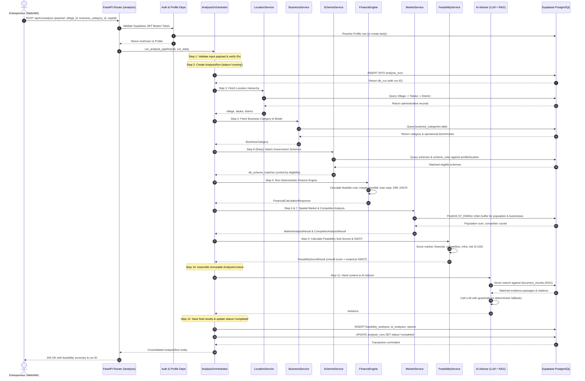
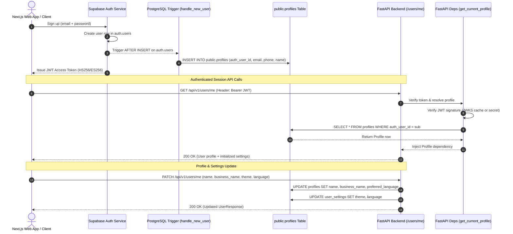

# 🔄 Data Flow Architecture — UdyamAI Platform

**Version:** 1.0.0  
**Status:** Active / Production Baseline  
**Primary Modules:** `backend/app/services/analysis_orchestrator.py`, `backend/app/api/deps.py`, `backend/app/finance/`

---

## 📌 1. Primary Analysis Workflow (12-Step Pipeline)

The central operational sequence of UdyamAI transforms a simple feasibility inquiry into a comprehensive enterprise assessment through a strict, transactional 12-step pipeline.



---

## 📍 2. Spatial Geo-Data Flow (PostGIS 10km Buffer)

UdyamAI calculates hyper-local market metrics without relying on proprietary maps APIs:

```mermaid
flowchart TD
    In[Village Location ID + Coordinates<br/>e.g., Lat 18.5204, Lon 73.8567] --> PostGIS[PostGIS Geography Function<br/>ST_DWithin(geom, ST_SetSRID(ST_Point(lon, lat), 4326)::geography, 10000)]
    
    PostGIS --> Pop[Spatial Aggregation on Villages<br/>SUM(population), SUM(households)]
    PostGIS --> Comp[Spatial Filter on Businesses<br/>WHERE category_id = target_category<br/>AND ST_DWithin(geom, target, 10000)]
    
    Pop --> MktOut[Market Reach Context<br/>- Population Reach: 45,200<br/>- Household Reach: 9,800<br/>- Target Customers: 2,400]
    Comp --> CompOut[Competition Context<br/>- Direct Competitors within 5km: 2<br/>- Total Competitors within 10km: 5<br/>- Competitor Density: 0.016 per km²]
```

---

## 💰 3. Financial Engine Data Flow

The financial pipeline converts entrepreneur parameters and scheme constraints into deterministic balance sheets:

```mermaid
flowchart LR
    subgraph Inputs
        Cap[Available Capital: ₹50,000]
        Des[Desired Project Cost: ₹2,00,000]
        Rule[Scheme Rule: PMEGP General<br/>Margin: 10%, Loan: 90%, Subsidy: 15%]
    end

    subgraph StepA[Equity & Project Sizing]
        RawCost["Project Cost (Raw) = ₹50,000 / 0.10 = ₹5,00,000"]
        TargetCost["Target Cost = min(₹5,00,000, ₹2,00,000) = ₹2,00,000"]
        FeasCost["Feasible Cost = Bound(₹2,00,000, min, max) = ₹2,00,000"]
    end

    subgraph StepB[Debt & Margin Sizing]
        ReqMargin["Required Margin = ₹2,00,000 × 10% = ₹20,000"]
        Shortfall["Margin Shortfall = max(0, ₹20,000 - ₹50,000) = ₹0"]
        RawLoan["Potential Loan = ₹2,00,000 × 90% = ₹1,80,000"]
        Subsidy["Estimated Subsidy = ₹2,00,000 × 15% = ₹30,000"]
    end

    subgraph StepC[Debt Service & Amortization]
        Schedule["Amortization Schedule<br/>Tenure: 84 mos | Rate: 8.5%<br/>Monthly EMI: ₹2,852"]
        DSCR["DSCR Stress Scenarios<br/>Worst: 1.15 | Expected: 1.62 | Best: 2.10"]
    end

    Inputs --> StepA --> StepB --> StepC
```



---

## 🔐 4. User Authentication & Profile Synchronization Data Flow

User identity and profile management flows seamlessly between Next.js, Supabase Auth, and the FastAPI application layer:


