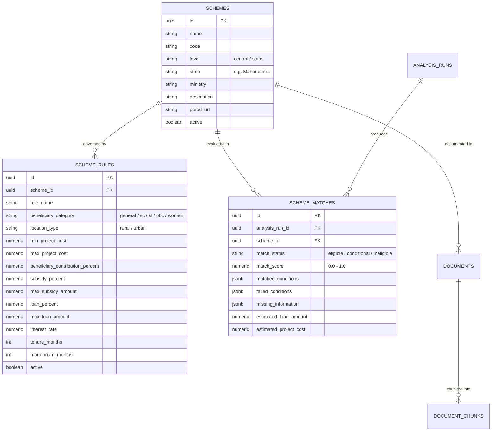
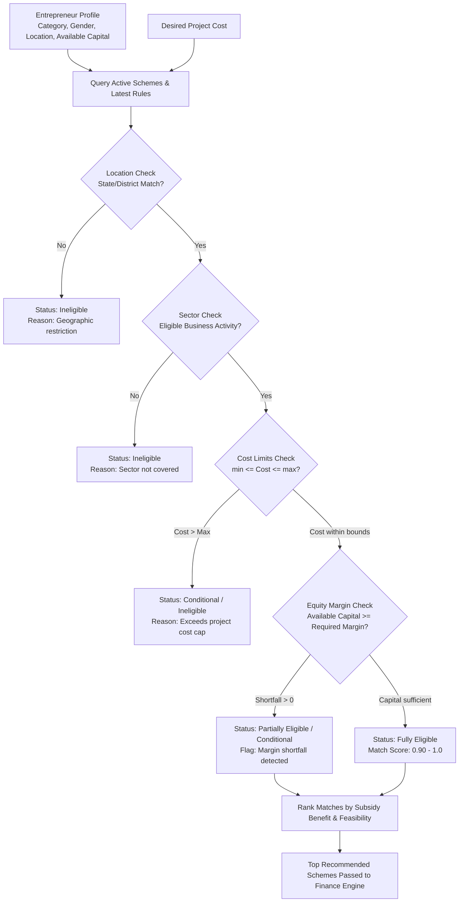

# 📜 Scheme Engine Architecture — UdyamAI Platform

**Version:** 1.0.0  
**Status:** Active / Production Baseline  
**Primary Modules:** `backend/app/schemes/`, `backend/app/services/scheme_service.py`, `backend/app/models/scheme.py`

---

## 📌 1. Overview & Objective

The **UdyamAI Scheme Engine** is an intelligent, rule-based recommendation and validation engine that evaluates micro-enterprise business profiles against Indian central and state government credit-linked subsidy schemes.

By systematically modeling eligibility criteria, financial assistance formulas, margin requirements, and moratorium rules, the Scheme Engine eliminates the friction, confusion, and exploitative intermediaries that typically hinder rural entrepreneurs from accessing state support.

---

## 🏛️ 2. Core Government Schemes Modeled

The initial deployment prioritizes high-impact central and Maharashtra state schemes:

| Scheme Name | Level | Administering Agency | Target Beneficiary | Key Assistance Pattern |
|---|---|---|---|---|
| **PMEGP** (Prime Minister's Employment Generation Programme) | Central | KVIC / MSME | Non-farm micro-enterprises | 15%–35% margin money subsidy; 5%–10% beneficiary contribution |
| **PMFME** (PM Formalisation of Micro food processing Enterprises) | Central | MoFPI | Micro food processing units | 35% capital subsidy (capped at ₹10 Lakh); 10% beneficiary equity |
| **CMEGP** (Chief Minister Employment Generation Programme) | State (Maharashtra) | Directorate of Industries (GoM) | Youth & rural micro-enterprises in Maharashtra | 15%–35% capital subsidy; dedicated rural quotas |
| **Pradhan Mantri Mudra Yojana (PMMY)** | Central | Commercial / RRBs / MFI | Micro units (Shishu / Kishore / Tarun) | Collateral-free credit up to ₹10 Lakh; low interest rates |

---

## 🗄️ 3. Relational Data Architecture

---

## ⚙️ 4. Rule Matching Pipeline

When an analysis is requested, `match_schemes_for_analysis` executes in `backend/app/schemes/matcher.py`:

---

## 🔍 5. RAG Verification & Traceability

1. **Document Grounding:**
   Each scheme is linked to its authoritative guideline PDF stored in the `documents` table.
2. **Chunk Level Linkage:**
   Chunks in `document_chunks` are tagged with `scheme_id`. When the Scheme Engine matches an enterprise to PMEGP, RAG retrieval automatically narrows vector searches to passages tagged with that specific `scheme_id`.
3. **Official Citation Guarantee:**
   The AI Advisor is prevented from citing rules from training memory. Citations must reference the exact document title, version, and page number retrieved from the vector store.
